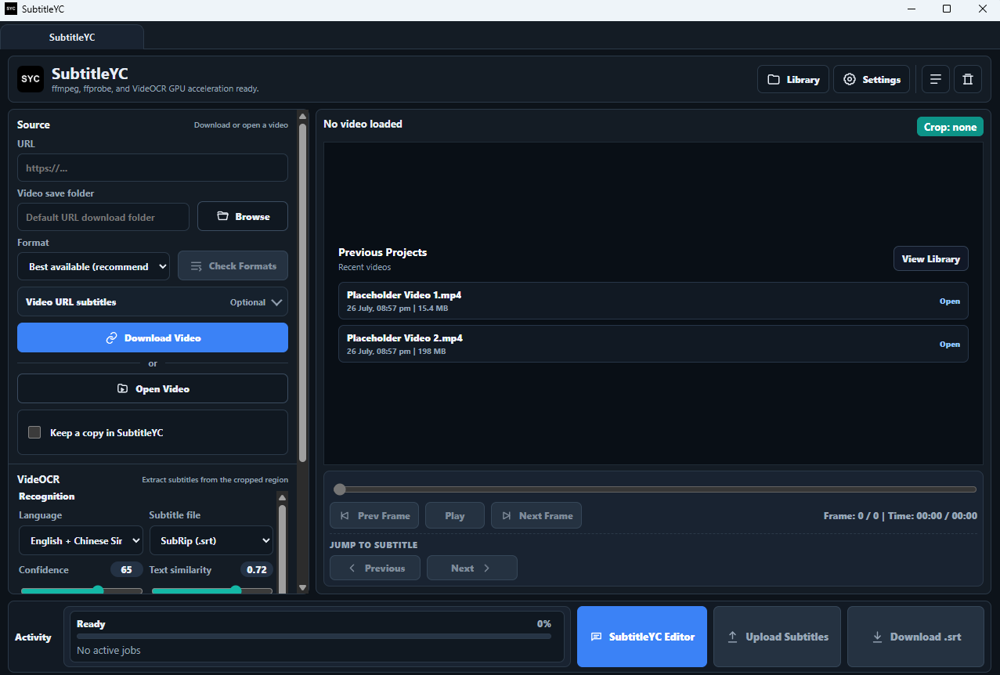
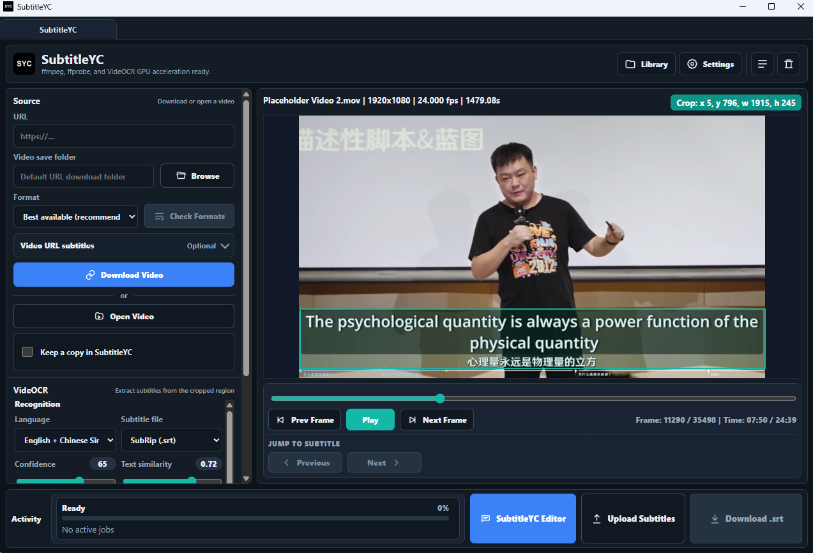
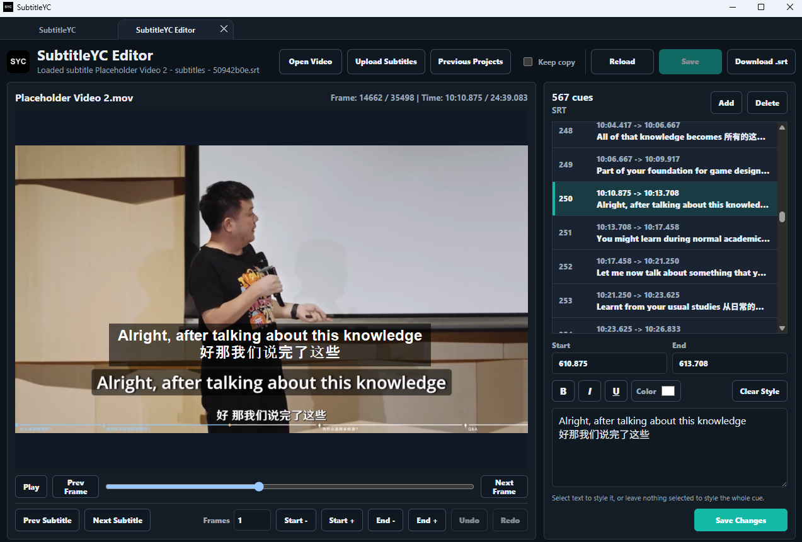

# SubtitleYC

[README](README.md) | [Contributing](CONTRIBUTING.md) | [MIT License](LICENSE) | [Security](SECURITY.md) | [Privacy](PRIVACY.md)

[](LICENSE)

SubtitleYC is open-source software released under the MIT License.
SubtitleYC is an open-source Windows desktop app for extracting, reviewing, and editing subtitles from burned-in video captions. It can download an authorised video URL with `yt-dlp` or open a local video, provide native frame-accurate preview and crop controls, run the VideOCR CLI, and export `.srt`, `.txt`, or `.ass` files.

> **Early release:** Keep backups and review generated subtitles before relying on them.

## Download

Download Windows builds from [GitHub Releases](https://github.com/BambooYC123/SubtitleYC/releases). The CPU edition works without an Nvidia GPU; the CUDA edition provides faster OCR on supported Nvidia systems.

The installers and their bundled application files are distributed under the MIT License. Bundled third-party tools retain their own licences, which are included with the installation.

The app opens as a normal desktop window. Internally it runs a private local FastAPI backend bound to `127.0.0.1`, so normal users do not need to manage a server or browser tab.

## How SubtitleYC Works

### 1. Open A Video Or Resume A Project

Download a video URL, open a local video, or resume one of your recent projects. SubtitleYC keeps the source controls, OCR settings, preview, and activity status together in the main workspace.



### 2. Define The Subtitle Region And Run OCR

Drag the crop box over the burned-in captions, choose the recognition language and output format, then run VideOCR. The activity panel shows extraction progress while the native preview remains available for frame checks.



### 3. Review, Correct, And Export

Open SubtitleYC Editor to inspect every cue alongside the video. You can adjust cue text and timing, step through individual frames, add or remove cues, save your changes, and export the finished subtitle file.



## Quick Start

1. Download the CPU or GPU Windows installer.
2. Launch `SubtitleYC.exe`.
3. Load a video from a URL or choose a local video file.
4. For a URL, let SubtitleYC auto-check available formats, optionally choose a specific format, and choose a download folder.
5. Scrub the preview and draw the crop box around the burned-in subtitle area.
6. Choose OCR language, subtitle output format, and timing/image settings.
7. Run VideOCR.
8. Review or edit subtitles, then download the generated subtitle file.

Only download videos you have the right to download.

The installer keeps application files under `Program Files\SubtitleYC` by default and creates Desktop and Start Menu shortcuts automatically. Its directory page can use a `Program Files` folder on another drive for the larger GPU edition. User projects, settings, logs, and generated files remain under `%LOCALAPPDATA%\SubtitleYC\workspace`, separate from the application.

## Main Features

- Download videos with `yt-dlp`, including automatic format checking, optional specific-format selection, custom save folder support, and optional site subtitle import.
- Uses Bilibili-specific format fallbacks such as `30080+30280` for 1080p plus Bilibili browser-style headers when the URL is from Bilibili.
- Select a local video file and load it immediately.
- Extract preview frames and probe video metadata with `ffmpeg` and `ffprobe`.
- Scrub video, step previous/next frame, and draw a reusable subtitle crop area.
- The preview opens immediately after a video is loaded. In the desktop app, the preview panel can use an integrated Qt/PySide native PyAV surface with an in-memory frame cache for VideOCR-like frame scrubbing.
- Run installed or bundled VideOCR CLI / PaddleOCR with advanced settings.
- Export subtitles as SubRip `.srt`, plain `.txt`, or Advanced SubStation Alpha `.ass`.
- Import timed subtitles from `.srt`, `.ass`, or `.ssa` into the current video session.
- Preview, edit, add, delete, save, and download subtitle cues.
- Nudge individual cue starts/ends by frames, shift all cues, and snap cues to the video frame grid.
- Jump to previous/next subtitle boundaries under the video preview.
- Separate activity rows for downloads and OCR jobs, with stop buttons for active jobs.
- In-app logs drawer with filtering, copy, save, refresh, and clear actions.
- In-app storage manager for clearing downloads, uploads, previews, generated subtitle files, VideOCR runtime files, and logs.
- English and Simplified Chinese interfaces, with the installer language carried into the app on first launch.
- Settings drawer for app language, default download folder, theme, OCR language, output format, and OCR/timing defaults.

## Subtitle Workflow

### Generating Subtitles

Select a video, draw the crop box, choose the subtitle output format, then click `Run VideOCR`. SubtitleYC passes the crop and settings to VideOCR CLI and converts the resulting timed cues into the selected output format.

Supported output formats:

- `.srt`: timed SubRip subtitles.
- `.txt`: plain text transcript generated from the recognized cues.
- `.ass`: Advanced SubStation Alpha subtitles.

### Editing Subtitles

Use `SubtitleYC Editor` to open the editor. From there you can:

- Edit cue text, start time, and end time.
- Add or delete cues.
- Seek the video to a cue.
- Nudge a cue start or end by a chosen frame amount.
- Move all cues earlier or later.
- Snap cue timing to the video frame grid.
- Save the edited cues back to the current subtitle file.

The desktop preview uses the integrated native PyAV surface when PySide6 is available, with the web canvas remaining as a fallback for browser or non-Qt mode.

The preview controls below the video can also nudge the currently visible or selected cue. `Prev Subtitle` jumps to the current subtitle start, or to the previous subtitle end if no subtitle is currently visible. `Next Subtitle` jumps to the current subtitle end, or to the next subtitle start if no subtitle is currently visible.

### Importing Subtitles

Use `Upload Subtitles` to attach an existing timed subtitle file to the current video. When downloading from a URL, open `Video URL subtitles` to check available site captions or auto-captions; SubtitleYC converts downloaded captions to `.srt` when possible and can attach one matching subtitle track to the session or download it separately.

Import supports:

- `.srt`
- `.ass`
- `.ssa`

Plain `.txt` files are export-only because they do not contain timing data.

## Downloadable App

Choose the installer containing the OCR runtime suitable for your PC:

- `SubtitleYC-0.4.0-windows-cpu-setup.exe`: recommended default for all Windows users.
- `SubtitleYC-0.4.0-windows-gpu-cuda-12.9-setup.exe`: Nvidia GTX 16 through RTX 50 series.

Each bundled installer contains exactly one VideOCR runtime. Installing another edition upgrades the same SubtitleYC installation and replaces the previous OCR runtime, avoiding duplicated multi-gigabyte files. GPU editions enable GPU acceleration on first run; CPU editions keep it unavailable.

The release page also includes source archives generated automatically by GitHub. Those archives are intended for developers and are not substitutes for the Windows installers.

## Required External Apps

If you use the bundled zip or installer, SubtitleYC first looks for tools inside the app folder:

```text
SubtitleYC\tools\videocr-cli-*\videocr-cli.exe
SubtitleYC\tools\ffmpeg\ffmpeg.exe
SubtitleYC\tools\ffmpeg\ffprobe.exe
```

If bundled tools are not present, SubtitleYC searches installed VideOCR CPU and GPU folders automatically, including versioned CLI directories under `C:\Program Files\VideOCR`.

If VideOCR is installed elsewhere, set `VIDEOCR_CLI` before launching SubtitleYC:

```powershell
$env:VIDEOCR_CLI = "C:\Path\To\videocr-cli.exe"
```

SubtitleYC also needs `ffmpeg` and `ffprobe` available either in the bundled `tools\ffmpeg` folder or on `PATH`.

## Useful Environment Variables

```powershell
$env:VIDEOCR_CLI = "C:\Path\To\videocr-cli.exe"
$env:SUBTITLEYC_DATA_DIR = "D:\SubtitleYCWorkspace"
$env:SUBTITLEYC_PORT = "8000"
$env:SUBTITLEYC_MAX_JOBS = "2"
$env:SUBTITLEYC_YTDLP_FRAGMENTS = "2"
$env:SUBTITLEYC_MAX_VIDEO_UPLOAD_MB = "20480"
$env:SUBTITLEYC_MIN_FREE_DISK_MB = "1024"
$env:SUBTITLEYC_NO_BROWSER = "1"
$env:SUBTITLEYC_USE_BROWSER = "1"
```

Notes:

- `SUBTITLEYC_DATA_DIR` moves the app workspace folder. If unset, packaged Windows builds use `%LOCALAPPDATA%\SubtitleYC\workspace`; development runs use `workspace\` in the checkout.
- `SUBTITLEYC_MAX_JOBS` is clamped from `1` to `2`.
- `SUBTITLEYC_YTDLP_FRAGMENTS` is clamped from `1` to `4`.
- `SUBTITLEYC_MAX_VIDEO_UPLOAD_MB` limits copied and browser-uploaded video files. The default is 20 GB.
- `SUBTITLEYC_MIN_FREE_DISK_MB` reserves free workspace/destination space during copies and downloads. The default is 1 GB.
- `SUBTITLEYC_NO_BROWSER` and `SUBTITLEYC_USE_BROWSER` are launcher diagnostics/fallback options.

## Settings

Settings autosave after you change them and are loaded again the next time SubtitleYC starts. The `Save Settings` button is still available when you want an explicit save before closing the drawer.

The Settings drawer can save defaults for:

- Download folder.
- OCR language and subtitle output format.
- Confidence, text similarity, SSIM, frames to skip, merge gap, minimum duration, and timing offset.
- Snap-to-frame behavior.
- Brightness threshold and max OCR image width.
- Server model, GPU acceleration, full-frame OCR, angle classification, post-processing, and Traditional Chinese normalization.

The first-run OCR language is English + Chinese Simplified. SubtitleYC exposes
VideOCR's local PaddleOCR models for common East, Southeast, South, West, and
Central Asian languages, along with major European languages. This includes
Simplified and Traditional Chinese, Japanese, Korean, Vietnamese, Thai,
Indonesian, Malay, Filipino/Tagalog, Hindi, Marathi, Nepali, Tamil, Telugu,
Arabic, Persian, Urdu, Uyghur, Turkish, Kazakh, and Mongolian. GPU acceleration
requires a compatible GPU and the VideOCR GPU build. When both CPU and GPU
builds are installed, SubtitleYC prefers the matching executable for the
selected mode.

## Keyboard Shortcuts

Main preview:

- `Space`: play or pause.
- `Left` / `Right`: previous or next frame.
- `Shift+Left` / `Shift+Right`: previous or next subtitle boundary.
- `Ctrl+O`: upload a video.
- `Ctrl+U`: upload subtitles for the current video.
- `Ctrl+E`: open the subtitle editor.

Subtitle editor:

- `Space`: play or pause.
- `Left` / `Right`: previous or next frame.
- `Shift+Left` / `Shift+Right`: previous or next subtitle boundary.
- `Ctrl+S`: save subtitle edits.
- `Ctrl+Z` / `Ctrl+Y`: undo or redo subtitle edits.
- `Ctrl+U`: upload subtitles.
- `Ctrl+R`: reload subtitles.
- `Delete`: delete the selected cue.
## Logs And Storage

Generated data lives under `%LOCALAPPDATA%\SubtitleYC\workspace` in packaged Windows builds, under `workspace\` in a development checkout, or under `SUBTITLEYC_DATA_DIR` if that variable is set.

Common folders:

```text
workspace\downloads
workspace\uploads
workspace\previews
workspace\results
workspace\logs
workspace\videocr-runtime
workspace\settings.json
```

Use `Logs` to inspect app, download, OCR, and error messages. Use `Storage` to review and clear generated files that SubtitleYC can safely recreate.

## Build Windows Releases

Build the small advanced-user zip without external tools:

```powershell
.\scripts\build-windows.ps1
```

For one self-contained edition, provide the matching installed or staged VideOCR CLI:

```powershell
.\scripts\build-installer.ps1 `
  -BundleExternalTools `
  -VideOCRVariant CPU `
  -VideOCRCliPath "C:\Program Files\VideOCR\videocr-cli-CPU-v1.5.1\videocr-cli.exe"
```

Valid variants are `CPU` and `GPU-CUDA-12.9`. GPU paths must match the requested CUDA edition, which prevents accidentally publishing a mislabeled installer.

For the public release matrix, stage the matching CPU and CUDA 12.9 packages, then run:

```powershell
.\scripts\build-public-releases.ps1 `
  -CpuVideOCRCliPath "C:\VideOCR-Staging\videocr-cli-CPU-v1.5.1\videocr-cli.exe" `
  -GpuCuda129VideOCRCliPath "C:\VideOCR-Staging\videocr-cli-GPU-v1.5.1-CUDA-12.9\videocr-cli.exe" `
  -FFmpegPath "C:\FFmpeg-Shared\bin\ffmpeg.exe" `
  -FFprobePath "C:\FFmpeg-Shared\bin\ffprobe.exe" `
  -ArtifactsRoot "D:\SubtitleYCBuild\SubtitleYC-0.4.0"
```

The matrix requires the same VideOCR version for both editions, compiles SubtitleYC once, then replaces the bundled OCR runtime for each installer. Use `-ArtifactsRoot` to place the large `build`, `dist`, and `release` directories on a drive with enough free space; omit it to use the repository directory. It produces CPU and CUDA 12.9 setup executables, local SHA-256 checksum files, and one build manifest tying both installers to the same source run. Public GitHub releases contain only the two setup executables; keep the checksums and manifest with the release records. For smaller packages without removing codecs, pass matching `ffmpeg.exe` and `ffprobe.exe` paths from FFmpeg's full shared build; the required adjacent DLLs are bundled automatically. See the [VideOCR release page](https://github.com/timminator/VideOCR/releases/latest) for the current CPU and GPU packages.

Release builds install only hashes pinned in `requirements-release.txt`, run `pip check` and `pip-audit`, collect third-party license files, and verify output checksums.

For a public release, use a trusted Windows code-signing certificate and require signing:

```powershell
$env:SUBTITLEYC_SIGNING_CERT_THUMBPRINT = "YOUR_CERTIFICATE_THUMBPRINT"
.\scripts\build-public-releases.ps1 `
  -CpuVideOCRCliPath "C:\VideOCR-Staging\videocr-cli-CPU-v1.5.1\videocr-cli.exe" `
  -GpuCuda129VideOCRCliPath "C:\VideOCR-Staging\videocr-cli-GPU-v1.5.1-CUDA-12.9\videocr-cli.exe" `
  -RequireSigning
```

The build locates `signtool.exe` from the Windows SDK, applies and verifies SHA-256 timestamped signatures, and refuses unsigned output when `-RequireSigning` is supplied.

## Security

SubtitleYC's API listens only on a random loopback port. The desktop launcher creates a private token for each run; API requests require that session, and foreign Host, Origin, and embedded browser navigation requests are rejected. The Qt bridge exposes only an explicit method allowlist.

Remote downloads accept only HTTP(S) URLs without embedded credentials. Video copies/uploads have configurable size limits, downloads and copies retain a free-disk reserve, subtitle uploads are capped, and partial failed uploads are removed. Treat downloaded media and subtitle files as untrusted data and keep SubtitleYC, yt-dlp, VideOCR, FFmpeg, and Windows security updates current.

See `SECURITY.md` for vulnerability reporting and `PRIVACY.md` for the app's
local storage, logging, and network behaviour.

## Run From Source

```powershell
python -m venv .venv
.\.venv\Scripts\Activate.ps1
python -m pip install -e .
subtitleyc
```

Or double-click:

```text
Start-SubtitleYC.bat
```

## Test

```powershell
python -m unittest discover -s tests
python -m compileall subtitleyc tests
```

`node --check static\app.js` can be used for JavaScript syntax checking if Node.js is installed.

## Notes

- Subtitle timing depends on source video FPS, crop quality, and OCR settings. Use timing offset, snap-to-frame, subtitle boundary jumps, and the subtitle editor for fine adjustments.
- Some sites may require newer yt-dlp extractor support or account-only access. SubtitleYC cannot bypass access restrictions.
- Active downloads and OCR jobs can be stopped from their activity rows.
## Contributing

Issues and pull requests are welcome. See `CONTRIBUTING.md` for environment,
testing, contribution, and security-reporting guidance.

## Acknowledgements

SubtitleYC is made possible by the work of these open-source projects and their
contributors:

- [VideOCR](https://github.com/timminator/VideOCR) provides the command-line OCR workflow used to extract burned-in subtitles.
- [yt-dlp](https://github.com/yt-dlp/yt-dlp) provides video, format, and site-subtitle downloading.
- [PaddleOCR](https://github.com/PaddlePaddle/PaddleOCR) provides the text-recognition engine used by VideOCR.
- [FFmpeg](https://github.com/FFmpeg/FFmpeg) provides media probing, conversion, and stream processing.
- [PyAV](https://github.com/PyAV-Org/PyAV) provides direct frame decoding for SubtitleYC's native video preview.
- [Qt for Python / PySide6](https://code.qt.io/cgit/pyside/pyside-setup.git/) provides the desktop window, WebEngine integration, and native interface components.
- [FastAPI](https://github.com/fastapi/fastapi) provides the private local API connecting the interface to SubtitleYC's Python services.
- [PyInstaller](https://github.com/pyinstaller/pyinstaller) and [Inno Setup](https://github.com/jrsoftware/issrc) provide Windows application and installer packaging.

Thank you to the maintainers and contributors of these projects. Their software
remains under its respective licence; see `THIRD-PARTY-NOTICES.txt` and the
`licenses` directory for detailed notices and source information.

## Licensing

SubtitleYC is open-source software licensed under the MIT License. You may use,
copy, modify, distribute, sublicense, and sell copies subject to the copyright
and permission notice in `LICENSE`.

SubtitleYC uses third-party software under separate licenses, including VideOCR
(MIT), yt-dlp (The Unlicense), Qt/PySide6 (LGPLv3), and the FFmpeg build bundled
with Windows releases (currently GPLv3-or-later). See
`THIRD-PARTY-NOTICES.txt` and the `licenses` directory for full notices, license
texts, source links, and build information.

Windows release builds also collect license files from the exact installed
Python distributions into `licenses/python`, so the notice bundle matches the
dependencies packaged in that release. They also generate exact FFmpeg hashes,
version output, and build configuration in
`licenses/FFmpeg-build/BUILD-INFO.txt`.
